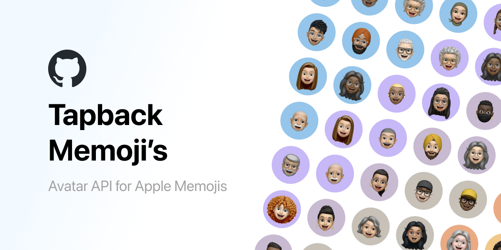

# Tapback Memoji's


[](https://github.com/wimell/Tapback-Memojis/stargazers)

## 🙏 Credits

This project is a fork of [wimell/Tapback-Memojis](https://github.com/wimell/Tapback-Memojis). Special thanks to the original author for creating the foundation of this avatar generation system.

**Original Project:** [https://github.com/wimell/Tapback-Memojis](https://github.com/wimell/Tapback-Memojis)


## 🚀 Overview

Tapback Memoji API provides a simple and efficient way to generate unique Apple Memoji style avatars for your applications. Create a random avatar, or generate one based on any string.

Check out the [website](https://www.tapback.co?ref=github-readme) for more information on the API, or install the Laravel app locally via the `src` directory.

Key use cases:
- Dynamic user avatars
- Placeholder avatars
- Figma prototyping


<div style="display: flex; align-items: center; gap: 10px;">
  
  
  
  
</div>

## 🔗 Usage

```
# Auto-detection (MAIN FEATURE)
/api/avatar/jennifer.webp → Female avatars
/api/avatar/daniel.webp → Male avatars

# Country-specific
/api/avatar/andrea.webp?country=IT → Male (Italian context)
/api/avatar/andrea.webp?country=US → Female (US context)

# Testing endpoints
/api/detect-gender/name → Simple detection
/api/detect-gender/name/detailed → Full analysis
/api/detect-gender/name/compare → Cross-country comparison
```

### 🤖 Smart auto-detection:
```
https://www.tapback.co/api/avatar/{name}.webp
```
Replace `{name}` with a first name - the API automatically detects gender!
- `john.webp` → male avatars
- `sarah.webp` → female avatars  
- `alex.webp` → unisex names default to random

### 🎯 Manual gender override:
```
https://www.tapback.co/api/avatar/{name}/{gender}.webp
```
Replace `{name}` with any string and `{gender}` with `male`, `female`, or `random`.

### Add color parameter:
```
https://www.tapback.co/api/avatar/{name}.webp?color=5
https://www.tapback.co/api/avatar/{name}/{gender}.webp?color=5
```
Color values range from 0-17.

### 🧪 Professional gender detection endpoints:
```
# Simple detection
https://www.tapback.co/api/detect-gender/john
→ {"name":"john","detected_gender":"male"}

# Country-specific detection  
https://www.tapback.co/api/detect-gender/andrea?country=US
→ {"detected_gender":"female","country":"US"}

# Detailed analysis with confidence levels
https://www.tapback.co/api/detect-gender/andrea/detailed
→ {"confidence":"medium","is_confident":true,"raw_result":"MostlyFemale"}

# Compare across 10 countries
https://www.tapback.co/api/detect-gender/robin/compare
→ {"results":{"US":"female","IT":"male","smart":"male"},"recommendation":"male"}
```

### Get a random avatar:
```
https://www.tapback.co/api/avatar.webp
```

## 🖼️ Example Implementation

🤖 **Auto-detection** (smart gender detection):
```html


```

🎯 **Manual override** (specify gender explicitly):
```html


```

🧪 **Test gender detection**:
```javascript
fetch('/api/detect-gender/john')
  .then(r => r.json())
  .then(data => console.log(data)); // {"name":"john","detected_gender":"male"}
```

## ✨ Features

- 🤖 **Professional gender detection** with 40,000+ names database (NEW!)
- 🌍 **Country-specific detection** (US, IT, FR, DE, ES, etc.)
- 📊 **Confidence levels** and detailed analysis endpoints
- 🧠 **Smart detection** with multi-country consensus for ambiguous names
- 🎯 **Manual gender override** (male, female, random)
- **27 unique male avatars, 31 female avatars**
- **18 customizable background colors**
- 🔍 Advanced name parsing with international character support
- Supports diverse names (Arabic, Spanish, Nordic, etc.)
- Unique avatars generated based on input string
- Consistent generation for the same input
- 100% backwards compatible
- No authentication required
- No external API calls - all processing local
- Fast response times
- Suitable for various applications
